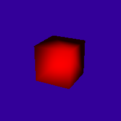
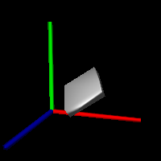

# Lab Assignment 4: Ray Tracing
Victoria Yong 1004455

   
  

## Sphere.h
The ray intersection was calculated using the following system of equations:

```
     (Rd.Rd) * t^2 + (2Rd.Ro) * t + (Ro.Ro - r^2) = 0
     '--,--'         '---,--'       '-----,-----'
        a                b                c
         
     a = 1 since ||Rd|| = ||d|| = 1
         
     discriminant = b^2 - 4a*c
```

## Triangle.h
The ray intersections for triangles can be calculated using barycentric coordinates, since the 3 triangle vertexes are given. 
To determine if the ray intersects with the triangle, we divide the triangle into 3 sub-triangles and calculate their areas (using their determinant matrices), $\beta$ and $\gamma$.
The ray intersects the triangle if the following conditions are met:
```
    (beta + gamma) <= 1 && beta >= 0 && gamma >= 0
    t<hit.getT() && t>tmin
```

## Plane.h
The ray intersections with a plane can be found using the following formula:
```
    Plane Eqn: n \cdot (o + t \cdot d) + offset = 0
    t = -(offset + n \cdot o)/ (n \cdot d)
```

## Material.h
In the Material object, we compute the diffuse and specular components of Phong lighting.
The diffuse components are calculated using the Phong equation as such:
```
    diffuse component:
    diffuseShading = n \cdot l
    clamp(diffuseShading) <diffuseShading can only have values >= 0>
    diffuseComponent = diffuseShading * lightColor * textureColor;
```

To calculate the specular components, we need to compute the direction of the reflected ray (r) and the original ray direction (v).
The specular term is large only when the viewer direction V is aligned with the reflection direction R.
The following Phong equations are used:
```
    specular component:
    r = 2n(n \cdot l) - l
    v = <original ray direction vector>
    specularShading = r \cdot v
    clamp(specularShading)
    specularComponent = pow(specularShading, shininess) * lightColor * specularColor
```

## Transform.h
In `Transform.h`, the intersect function first transforms the ray into the object's local coordindate frame
Given the original vector `v` and transformation matrix `m`, we can calculate the resulting origin and direction vectors of the ray using a cross product. The math has been implemented in `VecUtils.h`.